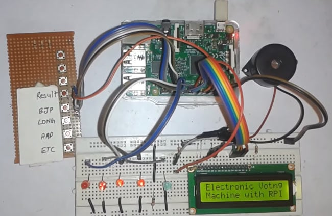

# Smart Electronic Voting Machine (Smart EVM)



A Smart Electronic Voting Machine (EVM) prototype built using **ESP32-CAM / Raspberry Pi, Flask, MongoDB, and Face Recognition**.  
This system ensures a secure, transparent, and tamper-proof voting process by using biometric voter authentication and encrypted vote storage.

---

## Features
- Face recognition-based voter authentication  
- Prevention of duplicate voting (one person, one vote)  
- Real-time verification and fast authentication  
- Encrypted vote storage for data security  
- Web-based admin panel for voter registration, monitoring, and publishing results  
- Cost-effective solution suitable for institutions and organizations  

---

## Technologies Used
**Hardware**
- ESP32-CAM / Raspberry Pi  
- OV2640 Camera Module  
- Push Buttons, LEDs, Buzzer  

**Software**
- Python, Flask (Backend)  
- OpenCV, dlib, face_recognition (Face Verification)  
- MongoDB (Database)  
- React.js / HTML, CSS, JavaScript (Admin Panel)  

---

## Project Structure
Smart-EVM/
├── src/
│   ├── main.py                   
│   ├── face_auth.py             
│
├── docs/
│   ├── Smart EVM Report.pdf
│   ├── Smart EVM.ppt
│
├── images/
│   ├── hardware-setup.jpg     
│   ├── block-diagram.png       
│
├── proteus_simulation/
│   ├── Electronic_voting_machine.pdsprj  
│   ├── proteus-circuit.png                
│
├── notes.txt                     # installation commands
├── requirements.txt              # Python dependencies
├── README.md

---

## Installation & Setup
1. Clone the repository:
   ```bash
   git clone https://github.com/YOUR-USERNAME/Smart-EVM.git
   cd Smart-EVM
2. Install dependencies:

   ``pip install -r requirements.txt``
   Or manually:
    ``` -pip install opencv-python```
    ``` -pip3 install face_recognition```
3. Run
    ```py.main and face_auth.main```
   
## Documentation
- [Project Presentation (PPT)](docs/Smart%20EVM.ppt)
- [Project Report (PDF)](docs/Smart%20EVM%20Report.pdf)

## Future Scope
  -Integration with fingerprint and face biometrics for higher accuracy
  -Blockchain-based vote storage for enhanced security
  -Mobile and remote voting support for migrant workers
  -AI-powered fraud detection in real time
